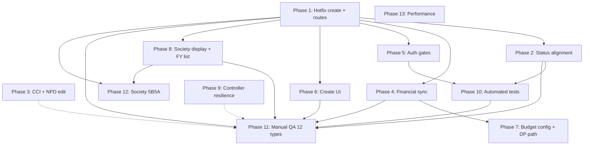

# Reporting System — Phase-Wise Implementation Plan

**Document Version:** 1.0  
**Date:** 2026-06-13  
**Based on:**
- [`Executor_Report_Writing_And_Budget_Gaps_Analysis.md`](./Executor_Report_Writing_And_Budget_Gaps_Analysis.md)
- [`Reporting_System_Comprehensive_Audit_And_Findings.md`](./Reporting_System_Comprehensive_Audit_And_Findings.md)
- Deep codebase scan (controllers, requests, models, views, routes, migrations, production log)

**Goal:** Restore reliable monthly report creation for all 12 project types, align authorization and budget data with documentation, and reduce split-brain between monthly / legacy quarterly / aggregated streams.

---

## 1. Current State Summary

### What works today

| Area | Status |
|------|--------|
| Unified monthly model (`DPReport`) | ✅ All 12 types route through `ReportController` |
| Row-level SOA via `BudgetCalculationService` | ✅ Strategies configured for 11/12 types |
| Monthly workflow (`ReportStatusService`) | ✅ Submit / forward / approve / revert |
| M3 approved scope for aggregation | ✅ `DPReport::APPROVED_STATUSES` |
| Edit SoA UI (6 partials) | ✅ Standardized |
| Activity store-when-user-filled | ✅ Implemented |
| Aggregated Q/HY/Annual from monthlies | ✅ Generally complete |
| CCI `StatisticsController::edit()` | ✅ Local fix uses empty model (not `firstOrFail`) |
| `DPReport::isEditable()` | ✅ Full revert status list already defined on model |

### What blocks production today

| Priority | Issue | Root cause (verified in code) |
|----------|-------|-------------------------------|
| **P0** | Monthly report create fails | `ReportController::createReport()` inserts without `society_id`; migration `2026_02_18_145049` enforces NOT NULL |
| **P0** | Legacy quarterly routes open | `routes/web.php:545–604` outside `auth` middleware |
| **P1** | Cannot edit after granular revert | `UpdateMonthlyReportRequest` hardcodes 3 statuses; model `isEditable()` has 9 |
| **P1** | SOA overview shows Rs. 0.00 | `projects.amount_sanctioned` not synced from type tables; `BudgetSyncService` flags default off |
| **P1** | Wrong IGE SOA on create | `ReportAll.blade.php:162` uses non-existent type string |
| **P2** | Incomplete create UI | Commented partials reference **missing blade files**; photos section commented out |
| **P2** | Approved projects hidden | `approvedProjects()` defaults current FY; `scopeInFinancialYear` excludes null commencement |

---

## 2. Implementation Principles

1. **Fix production blockers first** — no feature work until monthly create succeeds end-to-end.
2. **Single source of truth for statuses** — use `DPReport::isEditable()` (or extract `EDITABLE_STATUSES` constant) in requests, views, and provincial UI; align with `ReportStatusService::submitToProvincial`.
3. **One budget path for monthly** — canonical path is `BudgetCalculationService`; deprecate or align alternate DP controller.
4. **Do not uncomment missing partials blindly** — several referenced create partials do not exist; either create them or confirm generic fallback is sufficient.
5. **Feature-flag budget sync** — enable `BudgetSyncService` in staging before production repair.
6. **Test per project type** — Phase 10 manual matrix covers all 12 types.

---

## 3. Phase Overview

| Phase | Name | Effort | Blocks reporting? | Can parallelize? |
|-------|------|--------|-------------------|------------------|
| **1** | Emergency hotfix (create + auth + routes) | 1–2 days | **Yes — unblocks all** | No — do first |
| **2** | Workflow status alignment | 0.5 day | Yes — revert edit path | After Phase 1 |
| **3** | CCI deploy + NPD edit path | 0.5–1 day | CCI only | Parallel with 2 |
| **4** | Financial data sync & repair | 2–3 days | Wrong amounts | After Phase 1 |
| **5** | Create/store authorization gates | 1 day | Security + docs alignment | After Phase 1 |
| **6** | Create UI completeness | 2–3 days | UX for 7 types | After Phase 1 |
| **7** | Budget config & DP path unification | 1–2 days | NPD, DP accuracy | After Phase 4 |
| **8** | Society & approved-list UX | 1 day | Display consistency | After Phase 1 |
| **9** | Controller resilience & security cleanup | 1–2 days | 500 → 404 | Anytime after 1 |
| **10** | Automated tests | 2–3 days | Regression safety | After Phases 1–2 |
| **11** | Manual QA matrix (12 types) | 2–3 days | Sign-off | After Phases 1–8 |
| **12** | Society relational Phase 5B5A + docs | 1 week+ | Long-term integrity | After society backfill |
| **13** | Performance & dead code (optional) | 1 day | N+1, cleanup | Low priority |

**Total estimated effort:** 3–4 weeks (with staging validation between phases)

---

## Phase 1 — Emergency Hotfix: Report Create & Route Security

**Objective:** Executors can save a monthly report draft without SQL errors. Legacy quarterly routes require authentication.

**Priority:** P0 — deploy immediately.

### Tasks

#### 1.1 Fix `society_id` on report create

**File:** `app/Http/Controllers/Reports/Monthly/ReportController.php` — `createReport()` (~395–425)

**Current (broken):**
```php
$report = DPReport::create([...]); // no society_id
if ($project) {
    $report->society_id = $project->society_id;
    $report->save();
}
```

**Required change:**
- Load and validate `$project` **before** insert.
- Abort with clear 422/403 if `$project->society_id` is null (should not happen post Phase 4 society backfill).
- Include in single `create()` array: `society_id`, `society_name`, `province_id` from project.
- Wrap in `DB::transaction()` together with objectives/activities if multi-step.
- Remove redundant second `save()` unless other fields still need post-processing.

**Also check:** `MonthlyDevelopmentProjectController::store()` — if it creates `DPReport` rows, apply same snapshot pattern.

#### 1.2 Secure legacy quarterly routes

**File:** `routes/web.php` (~545–604)

**Change:** Move all five `reports/quarterly/*` route groups inside:
```php
Route::middleware(['auth', 'role:executor,applicant,provincial,coordinator,general'])->group(function () {
    // quarterly routes
});
```

Match role set used by aggregated routes (line 607).

#### 1.3 Smoke test after deploy

- Create draft report for `DP-0006`, `DP-0009` (previously failing in prod log).
- Confirm row in `DP_Reports` has non-null `society_id`, `province_id`.
- Hit one legacy quarterly index URL while logged out → expect redirect to login.

### Acceptance criteria

- [ ] Zero `Field 'society_id' doesn't have a default value` errors in logs after deploy.
- [ ] Unauthenticated users cannot access legacy quarterly CRUD.
- [ ] Existing reports (already backfilled) unaffected.

### Effort: 4–8 hours

---

## Phase 2 — Workflow Status Alignment

**Objective:** Executor/applicant can **edit** a report in every status where they can **submit** it.

**Priority:** P1

### Problem (deep scan)

| Layer | Editable statuses |
|-------|-------------------|
| `UpdateMonthlyReportRequest` | `draft`, `reverted_by_provincial`, `reverted_by_coordinator` (3) |
| `DPReport::isEditable()` | 9 statuses including all granular reverts |
| `ProvincialController` (dashboard) | 9 statuses (already aligned with model) |
| `ReportStatusService::submitToProvincial` | Same 9 as model |

**Gap:** Form request and model disagree; provincial UI is ahead of update authorization.

### Tasks

#### 2.1 Centralize editable statuses on `DPReport`

**File:** `app/Models/Reports/Monthly/DPReport.php`

Add constant (extract from `isEditable()`):
```php
public const EXECUTOR_EDITABLE_STATUSES = [
    self::STATUS_DRAFT,
    self::STATUS_REVERTED_BY_PROVINCIAL,
    self::STATUS_REVERTED_BY_COORDINATOR,
    self::STATUS_REVERTED_BY_GENERAL_AS_PROVINCIAL,
    self::STATUS_REVERTED_BY_GENERAL_AS_COORDINATOR,
    self::STATUS_REVERTED_TO_EXECUTOR,
    self::STATUS_REVERTED_TO_APPLICANT,
    self::STATUS_REVERTED_TO_PROVINCIAL,
    self::STATUS_REVERTED_TO_COORDINATOR,
];
```

Refactor `isEditable()` to use this constant.

#### 2.2 Update `UpdateMonthlyReportRequest`

**File:** `app/Http/Requests/Reports/Monthly/UpdateMonthlyReportRequest.php`

Replace hardcoded `$editableStatuses` with:
```php
if (!$report->isEditable()) { return false; }
```
Or `in_array($report->status, DPReport::EXECUTOR_EDITABLE_STATUSES)`.

Keep ownership check: `$report->user_id === $user->id || $report->project->in_charge == $user->id`.

#### 2.3 Align `ReportStatusService` (optional refactor)

Import same constant in `submitToProvincial()` allowed list to prevent future drift.

#### 2.4 Test scenarios

| Status | Edit | Submit |
|--------|------|--------|
| `draft` | ✅ | ✅ |
| `reverted_to_executor` | ✅ | ✅ |
| `reverted_by_general_as_provincial` | ✅ | ✅ |
| `submitted_to_provincial` | ❌ | ❌ |
| `forwarded_to_coordinator` | ❌ | ❌ |

### Acceptance criteria

- [ ] Reverted report (granular status) can be updated and resubmitted by executor.
- [ ] Submitted/in-review reports still blocked from edit.

### Effort: 3–4 hours

**Dependencies:** Phase 1 (need working create to test full lifecycle)

---

## Phase 3 — CCI & NPD Project Edit Path

**Objective:** Remove 500 errors that block users from reaching report context for CCI and NPD projects.

**Priority:** P1 (CCI), P2 (NPD)

### Tasks

#### 3.1 Deploy CCI statistics fix

**File:** `app/Http/Controllers/Projects/CCI/StatisticsController.php`

Local code already returns empty `ProjectCCIStatistics` model when missing (lines 64–67). **Verify production deployment.**

**Optional data repair:**
- Artisan command: insert minimal `ProjectCCIStatistics` row for CCI projects with none (`CCI-0001`, `CCI-0002` from prod log).

#### 3.2 NPD project edit — unknown type handler

**Prod log:** `ProjectController@edit - Unknown project type {"project_type":"NEXT PHASE - DEVELOPMENT PROPOSAL"}`

**File:** `app/Http/Controllers/Projects/ProjectController.php` — `edit()` switch

**Tasks:**
- Add `case ProjectType::NEXT_PHASE_DEVELOPMENT_PROPOSAL:` with same data loading as Development Projects (budget, objectives, logical framework) or explicit fallback branch.
- Ensure edit view renders without exception.

#### 3.3 Regression tests (manual)

| Project | Action | Expected |
|---------|--------|----------|
| CCI-0001 (no statistics) | Edit project | 200, empty statistics form |
| CCI with statistics | Edit project | 200, populated form |
| NPD project | Edit project | 200, no "unknown type" warning |

### Acceptance criteria

- [ ] No 500 on CCI edit without statistics record.
- [ ] NPD projects editable like DP (or documented fallback).

### Effort: 4–8 hours

**Dependencies:** None (parallel with Phase 2)

---

## Phase 4 — Financial Data Sync & Production Repair

**Objective:** `projects.amount_sanctioned` and `opening_balance` reflect type-specific budget data so report SOA **overview** fields and dashboards show correct values.

**Priority:** P1 — affects IGE, ILP, IAH, IES, IIES, and some DP/CIC projects.

### Root cause (verified)

- Report create uses `$project->amount_sanctioned` for overview (`ReportAll.blade.php`, controller).
- Individual/IGE budgets live in type tables; `projects.*` often stays 0 after approval.
- `ProjectFundFieldsResolver` exists (read-only); `BudgetSyncService` exists but:
  - `config/budget.php`: `sync_to_projects_on_type_save` = **false**
  - `sync_to_projects_before_approval` = **false**

**Production victims (from log):** IOGEP-0006, IAH-0002, ILA-0001, DP-0009 (opening_balance mismatch).

### Tasks

#### 4.1 Audit command (dry-run)

**Existing:** `app/Console/Commands/Phase2DryRunRepairSimulation.php`

**Run:**
```bash
php artisan phase2:dry-run-repair-simulation
# (verify exact signature in command)
```

**Output:** CSV/list of approved projects where:
- `amount_sanctioned = 0` OR
- `opening_balance != overall_project_budget` (per `FinancialInvariantService` rules)

#### 4.2 Staging repair

- Use `BudgetSyncService::syncBeforeApproval()` or admin reconciliation (`BudgetReconciliationController`) for affected projects.
- Re-run invariant checks; confirm warnings gone for IOGEP-0006, IAH-0002, ILA-0001.

#### 4.3 Enable ongoing sync (feature flags)

**File:** `config/budget.php` / `.env`

| Flag | Staging | Production (after validation) |
|------|---------|-------------------------------|
| `BUDGET_SYNC_ON_TYPE_SAVE` | true | true |
| `BUDGET_SYNC_BEFORE_APPROVAL` | true | true |

**Wire points:** Type-specific budget save controllers + approval flow in `ProjectStatusService` / provincial approve action.

#### 4.4 Report overview fallback (defensive)

**File:** `ReportController::create()` / view composer

If `$project->amount_sanctioned == 0` and project is approved:
- Resolve via `ProjectFinancialResolver` or `ProjectFundFieldsResolver`.
- Pass `$resolvedFundFields` to view (pattern already used on project show).

**Files:** `ReportAll.blade.php`, `edit.blade.php` — use resolved value for `amount_sanctioned_overview` default.

#### 4.5 Verify IGE budget field mapping

**File:** `config/budget.php` — IGE entry

Confirm `ProjectIGEBudget` columns:
- `'particular' => 'name'` 
- `'amount' => 'total_amount'`

Compare against actual DB schema and a live IOGEP project in staging.

### Acceptance criteria

- [ ] Dry-run audit report archived in `Documentations/Reports/`.
- [ ] Repaired projects pass `FinancialInvariantService` checks.
- [ ] New approvals sync fund fields automatically.
- [ ] Report create shows non-zero overview for repaired individual/IGE projects.

### Effort: 2–3 days

**Dependencies:** Phase 1 (reports creatable for validation)

---

## Phase 5 — Create/Store Authorization Gates

**Objective:** Match documented rule: only **approved** projects owned/in-charge by executor/applicant can create monthly reports.

**Priority:** P1 (security + docs alignment)

### Tasks

#### 5.1 Gate `ReportController::create()`

After loading project:
```php
if (!ProjectStatus::isApproved($project->status)) {
    abort(403, 'Reports can only be created for approved projects.');
}
if (!ProjectPermissionHelper::isOwnerOrInCharge($project, auth()->user())) {
    abort(403, 'You do not have permission to create reports for this project.');
}
if (!ProjectPermissionHelper::passesProvinceCheck($project, auth()->user())) {
    abort(403);
}
```

#### 5.2 Gate `StoreMonthlyReportRequest::authorize()`

Load project by `$this->input('project_id')`; apply same checks as 5.1.

#### 5.3 Gate alternate DP path

**File:** `MonthlyDevelopmentProjectController::createForm()`, `store()`

Apply identical gates (currently uses raw `$request->validate` without FormRequest authorization).

#### 5.4 Duplicate report period check (if not present)

Prevent two drafts for same `project_id` + `report_month_year` unless business allows — verify existing logic in `ReportController::store()`.

### Acceptance criteria

- [ ] Cannot create report for draft/submitted/reverted **project**.
- [ ] Cannot create report for another executor's project (IDOR).
- [ ] Approved + in-charge path still works.

### Effort: 1 day

**Dependencies:** Phase 1

---

## Phase 6 — Create UI Completeness (`ReportAll.blade.php`)

**Objective:** Monthly **create** form parity with **edit** for all 12 types.

**Priority:** P2 — SOA works via fallback; top sections and photos missing.

### Deep scan finding: missing partial files

Commented block in `ReportAll.blade.php` (lines 90–112) references partials that **do not exist**:

| Referenced partial | Exists? |
|--------------------|---------|
| `create/child_care_institution` | ❌ |
| `partials/rural_urban_tribal` | ❌ |
| `create/next_phase_development` | ❌ |
| `create/individual_*` (4 files) | ❌ |

**Existing create partials:** LDP annexure, IGE, RST, CIC, objectives, photos (file exists but section commented), attachments router.

### Tasks

#### 6.1 Decision matrix (per type)

| Type | Type-specific create section needed? | Action |
|------|--------------------------------------|--------|
| DP | Optional (objectives in generic partial) | Keep generic OR link to `reportform` (Phase 7) |
| LDP, IGE, RST, CIC | Yes — already active | No change |
| CCI, Edu-RUT, NPD | Uses development_projects SOA only | **Confirm:** no extra section needed → document as intentional |
| ILP, IAH, IES, IIES | SOA partials active below fold | **Confirm:** no extra top section OR create minimal partials |

**Recommendation:** For types without dedicated create partials, **do not uncomment** broken includes. Instead:
- Document that generic objectives + type-aware SOA is sufficient.
- OR create thin partials only if business requires type-specific fields on create (match edit sections).

#### 6.2 Fix IGE SOA routing on create

**File:** `ReportAll.blade.php` line 162

**Change:**
```blade
@elseif($project->project_type === 'Institutional Ongoing Group Educational proposal')
```

Remove dead branch `'Institutional - Initial - Educational support'` (not a valid `ProjectType` constant).

#### 6.3 Uncomment photos on create

**File:** `ReportAll.blade.php` lines 173+

Uncomment photos section OR include:
```blade
@include('reports.monthly.partials.create.photos', [...])
```

Verify `ReportController::store()` handles photo upload on create (already does on edit).

#### 6.4 Unify SOA routing on create

Replace long `@if/@elseif` chain with same router as edit:
```blade
@include('reports.monthly.partials.create.statements_of_account', ...)
```
Router already maps all 12 types (`partials/create/statements_of_account.blade.php` or shared router).

Add `NEXT PHASE - DEVELOPMENT PROPOSAL` to `$projectTypeMap` in router partials.

#### 6.5 Fix duplicate key in view SOA router

**File:** `partials/view/statements_of_account.blade.php` lines 10–11 — remove duplicate IES key.

### Acceptance criteria

- [ ] Create form renders photos section.
- [ ] IGE create uses `institutional_education` SOA partial.
- [ ] No references to non-existent blade files.
- [ ] V1 COMPREHENSIVE doc updated with actual create coverage decision.

### Effort: 2–3 days (less if generic fallback accepted for 7 types)

**Dependencies:** Phase 1

---

## Phase 7 — Budget Config & Development Project Path

**Objective:** One budget resolution path for monthly reports; explicit config for NPD.

**Priority:** P1 (NPD), P2 (DP dual path)

### Tasks

#### 7.1 Add NPD to `config/budget.php`

**File:** `config/budget.php`

Add entry mirroring Development Projects (if NPD uses `ProjectBudget` + phases):
```php
'NEXT PHASE - DEVELOPMENT PROPOSAL' => [
    'model' => ProjectBudget::class,
    'strategy' => DirectMappingStrategy::class,
    'fields' => [...],
    'phase_based' => true,
    'phase_selection' => 'current',
],
```

Verify against NPD budget tables in codebase.

#### 7.2 Resolve DP dual create path

**Options (pick one):**

| Option | Action |
|--------|--------|
| **A (recommended)** | Deprecate `monthly.developmentProject.create` route; remove or redirect to `monthly.report.create` |
| **B** | Link "Write Report" on approved DP projects to `reportform` when activity-based photos required |
| **C** | Merge `reportform` photo UX into `ReportAll` |

**If keeping alternate path:** Refactor `MonthlyDevelopmentProjectController` to use `BudgetCalculationService::getBudgetsForReport()` instead of `max('phase')`.

#### 7.3 Export budget alignment

**File:** `ExportReportController`

Evaluate using `getBudgetsForReport($project, true)` for PDF/DOC so export matches edit/show contribution logic.

### Acceptance criteria

- [ ] NPD reports use explicit strategy (no fallback warning in logs).
- [ ] DP monthly budget rows match project show / coordinator dashboard.
- [ ] Single documented create entry point for DP.

### Effort: 1–2 days

**Dependencies:** Phase 4 (budget service stable)

---

## Phase 8 — Society Display & Approved Projects List

**Objective:** Form display matches persisted snapshot; approved projects visible for reporting.

**Priority:** P2

### Tasks

#### 8.1 Fix create form basic info display

**File:** `ReportAll.blade.php` lines 37–41

| Field | Current | Should be |
|-------|---------|-----------|
| Place | `$user->center` | `$project->place` or center from project |
| Society | `$user->society_name` | `optional($project->society)->name ?? $project->society_name` |

Keep fields readonly; values must match what `createReport()` persists.

#### 8.2 Approved projects FY filter UX

**File:** `app/Http/Controllers/Projects/ProjectController.php` — `approvedProjects()`

**Options:**
- Default `$fy` to empty (all years) instead of `FinancialYearHelper::currentFY()`.
- OR include projects with `null` commencement when FY filter active:
  ```php
  $query->where(function ($q) use ($fy, $start, $end) {
      $q->whereBetween(...)->orWhereNull('commencement_month_year');
  });
  ```
- Add UI hint on `approved.blade.php`: "Projects with no commencement date are hidden when a financial year is selected."

#### 8.3 Legacy quarterly society input

**Files:** `Quarterly/*Controller.php`

Long-term: stop accepting `society_name` from request; snapshot from project (same as monthly). Lower priority unless actively used.

### Acceptance criteria

- [ ] Report basic info on create matches stored `DP_Reports` snapshot.
- [ ] Approved projects with null commencement appear in default list (or FY default changed).

### Effort: 1 day

**Dependencies:** Phase 1

---

## Phase 9 — Controller Resilience & Security Cleanup

**Objective:** Graceful 404s; remove debug routes; reduce dead code.

**Priority:** P2

### Tasks (from V2 Phase 3 + audit)

#### 9.1 Replace `firstOrFail()` in report controllers

**Files (~12+ call sites):**
- `ReportController.php` (12)
- `ExportReportController.php` (2)
- `ReportAttachmentController.php` (5)
- Aggregated controllers (2 each)

**Pattern:**
```php
$report = DPReport::where('report_id', $id)->first();
if (!$report) {
    abort(404, 'Report not found.');
}
```

Keep `firstOrFail()` only after authorization proves ID valid.

#### 9.2 Remove or protect debug routes

**File:** `routes/web.php` — `test-structure`, `test-create-attachment`, `test-expenses`

Remove from production or gate behind `APP_DEBUG`.

#### 9.3 Remove dead controller

**File:** `PartialDevelopmentLivelihoodController.php` — no routes; delete or archive.

### Acceptance criteria

- [ ] Invalid report ID returns 404 page, not 500.
- [ ] No public test routes in production.

### Effort: 1–2 days

---

## Phase 10 — Automated Tests

**Objective:** Prevent regression on Phases 1–2 and budget/report integration.

**Priority:** P2 — high value before Phase 11 manual QA.

### Tasks

#### 10.1 Feature tests (new file `tests/Feature/MonthlyReportTest.php`)

| Test | Covers |
|------|--------|
| `test_executor_can_create_draft_report_for_approved_project` | Phase 1 + 5 |
| `test_create_fails_without_society_id_on_project` | Phase 1 edge case |
| `test_create_rejected_for_unapproved_project` | Phase 5 |
| `test_executor_can_edit_reverted_to_executor_report` | Phase 2 |
| `test_executor_cannot_edit_submitted_report` | Phase 2 |
| `test_unauthenticated_cannot_access_quarterly_routes` | Phase 1 |

Use factories: `DPReportFactory`, project with `society_id`.

#### 10.2 Unit tests for budget in reports

**New file:** `tests/Unit/Services/BudgetCalculationServiceReportTest.php`

- One test per strategy type (DP, ILP, IIES) verifying `getBudgetsForReport` returns rows with `amount_sanctioned` calculated.

#### 10.3 Fix autoload reference

Composer references missing `BudgetCalculationServiceTest` — create file or remove autoload entry.

### Acceptance criteria

- [ ] `php artisan test` passes with new report tests.
- [ ] CI runs report tests on PR.

### Effort: 2–3 days

**Dependencies:** Phases 1, 2, 5

---

## Phase 11 — Manual QA Matrix (All 12 Project Types)

**Objective:** Complete V1 Phase 11 checklist; sign-off per type.

**Priority:** Required before declaring "12/12 complete".

### Test matrix

For **each** project type, execute on staging:

| Step | Action | Pass criteria |
|------|--------|---------------|
| 1 | Open approved project → Write Report | Create form loads |
| 2 | Save as Draft | No SQL/validation error; `DP_Reports` row created |
| 3 | Verify basic info | Society/place match project |
| 4 | Verify SOA rows | Budget lines match project budget; amounts non-zero where expected |
| 5 | Add photo + attachment | Files stored under correct period path |
| 6 | Submit to provincial | Status changes |
| 7 | Provincial revert to executor | Status = granular revert |
| 8 | Edit + resubmit | Phase 2 fix verified |
| 9 | Approve through coordinator | Status in `APPROVED_STATUSES` |
| 10 | Generate aggregated quarterly | Monthly data appears in aggregation |

### Per-type notes

| Type | Extra checks |
|------|--------------|
| LDP | Livelihood annexure section saved |
| RST | Trainee profiles |
| CIC | Inmate profiles |
| IGE | Age profiles; institutional_education SOA |
| ILP/IAH/IES/IIES | Contribution columns in SOA |
| CCI | Project edit works without statistics |
| NPD | Edit + budget fallback |
| DP | Overview amount matches resolver |

### Deliverable

**File:** `Documentations/Reports/Phase11_Manual_QA_Results.md` (create during execution)

### Effort: 2–3 days

**Dependencies:** Phases 1–8

---

## Phase 12 — Society Relational Alignment (Wave 5B5A)

**Objective:** Long-term consistency between monthly, aggregated, and legacy report society fields.

**Reference:** `Documentations/V2/Societies/Mapping/Reports/Reports_Relational_Readiness_Audit.md`

### Prerequisites

- [ ] `projects.society_id` populated for all active projects (Phase 4 society work).
- [ ] Monthly create persists snapshot correctly (Phase 1).

### Tasks

1. Add `society_id` FK to legacy quarterly / aggregated report tables (if not already).
2. Backfill existing report rows from `project_id → projects.society_id`.
3. Read path: `$report->society?->name ?? $report->society_name`.
4. Stop writing `$user->society_name` anywhere in report pipeline.

### Effort: 1 week+ (schema + backfill + validation)

**Dependencies:** Phases 1, 8, society project backfill

---

## Phase 13 — Performance & Cleanup (Optional)

**Reference:** V2 plan Phases 5–6

### Tasks

- Eager-load `$project->reports` in coordinator/provincial/executor dashboards.
- Downgrade IIES "no family members" log from WARNING to INFO if business confirms expected.
- Document naming conventions (`DP_Reports` PascalCase vs snake_case).
- Legacy quarterly: evaluate deprecation in favor of aggregated-only quarterly.

### Effort: 1–2 days

---

## 4. Dependency Graph



---

## 5. Deployment & Rollback Strategy

| Phase | Deploy target | Rollback |
|-------|---------------|----------|
| 1 | Production immediately | Revert `createReport()` + routes; hotfix forward-only |
| 2–3 | Staging → Production | Revert request/model changes |
| 4 | Staging required | DB repair rollback via backup; disable sync flags |
| 5 | Staging → Production | Revert authorization (loosens security — avoid) |
| 6–8 | Staging → Production | Revert blade/controller UX |
| 9–10 | Staging → Production | Revert tests/controllers |
| 11 | Sign-off gate | N/A |
| 12 | Maintenance window | Migration down + backup restore |

**Post-deploy monitoring (every phase):**
```bash
# Watch for report errors
grep -E "Failed to create report|society_id|Financial invariant" storage/logs/laravel.log
```

---

## 6. Mapping: Audit Findings → Phases

| Finding ID (from Comprehensive Audit) | Phase |
|---------------------------------------|-------|
| P0 #1 society_id create failure | **Phase 1** |
| P0 #2 quarterly routes unauthenticated | **Phase 1** |
| P1 #3 edit vs submit status mismatch | **Phase 2** |
| P1 #4 no approval gate on create | **Phase 5** |
| P1 #5 amount_sanctioned = 0 | **Phase 4** |
| P1 #6 NPD missing from budget config | **Phase 7** |
| P1 #7 wrong IGE type string | **Phase 6** |
| P1 #8 CCI statistics 500 | **Phase 3** |
| P1 #9 dual DP budget path | **Phase 7** |
| P2 #10 commented create partials | **Phase 6** |
| P2 #11 photos commented on create | **Phase 6** |
| P2 #12 FY filter hides projects | **Phase 8** |
| P2 #13 duplicate view router key | **Phase 6** |
| P2 #14 V1 docs overstated | **Phase 11** (update docs after QA) |
| P2 #15 no report tests | **Phase 10** |
| Society snapshot display mismatch | **Phase 8** |
| Society 5B5A relational | **Phase 12** |
| firstOrFail 500s | **Phase 9** |
| N+1 reports | **Phase 13** |

---

## 7. Sign-off Checklist (Per Phase)

Use this for each phase before moving on:

- [ ] Code reviewed
- [ ] Unit/feature tests added or updated (where applicable)
- [ ] Tested on staging with at least 2 project types (1 institutional + 1 individual)
- [ ] Production deploy completed
- [ ] Post-deploy log check (24h)
- [ ] Implementation log added to `Documentations/Reports/Phase{N}_Implementation_Log.md`

---

## 8. Recommended Execution Order (Sprint View)

### Sprint 1 (Week 1) — Unblock executors

1. Phase 1 — Hotfix (**deploy day 1**)
2. Phase 2 — Status alignment
3. Phase 3 — CCI/NPD (parallel)
4. Phase 5 — Auth gates
5. Phase 8 — Society display + FY list (quick wins)

### Sprint 2 (Week 2) — Data & UI

6. Phase 4 — Financial sync + repair
7. Phase 6 — Create UI
8. Phase 7 — Budget config + DP path

### Sprint 3 (Week 3) — Quality

9. Phase 9 — Controller resilience
10. Phase 10 — Automated tests
11. Phase 11 — Manual QA matrix

### Sprint 4+ (Backlog)

12. Phase 12 — Society 5B5A
13. Phase 13 — Performance & cleanup

---

## 9. Key Files Reference

| Concern | Primary files |
|---------|---------------|
| Report create / society | `app/Http/Controllers/Reports/Monthly/ReportController.php` |
| Store/update auth | `app/Http/Requests/Reports/Monthly/StoreMonthlyReportRequest.php`, `UpdateMonthlyReportRequest.php` |
| Editable statuses | `app/Models/Reports/Monthly/DPReport.php` (`isEditable`, new constant) |
| Submit workflow | `app/Services/ReportStatusService.php` |
| Create UI | `resources/views/reports/monthly/ReportAll.blade.php` |
| SOA routers | `resources/views/reports/monthly/partials/*/statements_of_account*.blade.php` |
| Budget config | `config/budget.php`, `app/Services/Budget/BudgetCalculationService.php` |
| Fund sync | `app/Services/Budget/BudgetSyncService.php`, `ProjectFundFieldsResolver.php` |
| Permissions | `app/Helpers/ProjectPermissionHelper.php` |
| Routes | `routes/web.php` (452–667) |
| Approved list | `app/Http/Controllers/Projects/ProjectController.php` (`approvedProjects`) |
| CCI edit | `app/Http/Controllers/Projects/CCI/StatisticsController.php` |
| Society migration | `database/migrations/2026_02_18_145049_enforce_report_society_snapshot_not_null_and_fk.php` |
| Dry-run repair | `app/Console/Commands/Phase2DryRunRepairSimulation.php` |

---

*End of plan. Update this document as phases complete; link each phase log from Section 7.*
